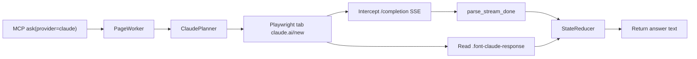

# Claude Provider Design

**Date:** 2026-07-12  
**Status:** Approved  
**Scope:** Add Claude (claude.ai web) as a third provider in AI Router

## Summary

Add a `claude` provider that automates authenticated Claude web sessions via Playwright/CloakBrowser, following the same adapter pattern as ChatGPT and Gemini. Each `ask` opens a new chat, submits a prompt through the DOM, listens to the `/completion` SSE endpoint for stream-end signals, and reads the answer text from the DOM.

## Requirements (confirmed)

| Decision | Choice |
|----------|--------|
| Answer source | DOM only (stream is signal-only, like ChatGPT) |
| Thinking blocks | Take full assistant message content from DOM; no filtering |
| Chat lifecycle | New chat per `ask` → navigate to `https://claude.ai/new` |
| Model selection | Use account default; no UI intervention |
| DOM selectors | Response selectors from user HTML; input/submit discovered during implementation |

## Architecture



### Per-ask flow

1. `goto` → `https://claude.ai/new`
2. `wait_idle` → prompt input ready
3. `clear_input` → `type` → `submit`
4. `wait_generating` → generation started
5. `wait_answer` → stream end + DOM stable (StateReducer hybrid gate)
6. Read text from last assistant message

## Module structure

```
src/ai_router/adapters/claude/
├── __init__.py
├── adapter.py      # ClaudeAdapter
├── selectors.py    # URLs, regex, DOM selectors, error markers
├── stream.py       # parse_stream_done, SSE payload iterator
├── wait.py         # is_stop_visible, read_response_snapshot, submit_ready
└── planner.py      # ClaudePlanner
```

### ClaudeAdapter

| Field | Value |
|-------|-------|
| `id` | `"claude"` |
| `name` | `"Claude"` |
| `keywords` | `["claude", "@claude", "anthropic"]` |
| `status` | `"available"` |

`build_profile()` mirrors ChatGPT wiring:

```python
ProviderProfile(
    provider_id="claude",
    stream_url_re=CLAUDE_COMPLETION_RE,
    parse_stream_done=parse_stream_done,
    is_stop_visible=is_stop_visible,
    read_response_snapshot=read_response_snapshot,
    is_rate_limited=is_rate_limited,
    submit_ready=submit_ready,
    planner=ClaudePlanner(),
    selectors=ProviderSelectors(
        prompt_input=SEL_PROMPT_INPUT,
        submit_button=SEL_SUBMIT_BUTTON,
    ),
    error_markers=CLAUDE_ERROR_MARKERS,
    recoverable_codes=("CLAUDE_ERROR",),
    answer_timeout_s=cfg.claude_answer_timeout_s,
    parse_ws_frame=None,
)
```

## Stream parsing

### Network interception

```python
CLAUDE_COMPLETION_RE = re.compile(
    r"/api/organizations/[^/]+/chat_conversations/[^/]+/completion(?:\?|$)",
    re.I,
)
```

Matches only the completion SSE endpoint. Organization and conversation IDs are dynamic per account/session.

### SSE format

Claude web uses Anthropic-style SSE:

```
event: message_delta
data: {"type":"message_delta","delta":{"stop_reason":"end_turn",...}}

event: message_stop
data: {"type":"message_stop"}
```

Intermediate events (`content_block_delta` with `thinking_delta` or `text_delta`) are ignored for answer extraction; they may appear in the stream but are not used for completion detection beyond confirming the stream is active.

### `parse_stream_done(status, body) → StreamDone`

| Condition | Result |
|-----------|--------|
| HTTP 401, 403, 429 or body contains rate-limit markers | `done=True, ok=False, error_kind="rate_limit"` |
| HTTP ≥ 400 (other) | `done=True, ok=False, error_kind="error"` |
| Payload `type == "message_stop"` | `done=True, ok=True` |
| Payload `type == "message_delta"` with `delta.stop_reason == "end_turn"` | `done=True, ok=True` |
| `message_limit` with non-`within_limit` status | `done=True, ok=False, error_kind="rate_limit"` |
| No end signal yet | `done=False, ok=False` |

`message_limit` events with `status: "within_limit"` are informational only and do not affect the verdict.

## DOM selectors

### Response (from captured HTML)

```python
SEL_ASSISTANT_MESSAGE = 'div[data-last-message="true"]'
SEL_ASSISTANT_TEXT = ".font-claude-response"
SEL_STREAMING = 'div[data-is-streaming="true"]'
SEL_ACTION_BAR = "[data-message-action-bar]"
```

### `read_response_snapshot(page)`

1. Count assistant turns via `div[role="article"]` or `[data-last-message="true"]`
2. Read `.font-claude-response` inner_text from the last message

### `is_stop_visible(page)`

Returns `True` when either:

- `div[data-is-streaming="true"]` exists, or
- A Stop button is visible (discovered during implementation, e.g. `aria-label*="Stop"`)

### Input / submit (discover during implementation)

```python
CLAUDE_URL = "https://claude.ai/new"

SEL_PROMPT_INPUT = (
    'div[contenteditable="true"][data-placeholder], '
    'div.ProseMirror[contenteditable="true"], '
    'textarea'
)
SEL_SUBMIT_BUTTON = (
    'button[aria-label*="Send" i], '
    'button[data-testid="send-button"]'
)
SEL_LOGIN = 'a[href*="/login"], button:has-text("Log in")'
```

### Error markers

```python
CLAUDE_ERROR_MARKERS = (
    "something went wrong",
    "unable to respond",
    "an error occurred",
)

RATE_LIMIT_MARKERS = (
    "rate limit",
    "usage limit",
    "too many messages",
    "try again later",
)
```

## Planner

```python
[
    Command("goto", {"url": CLAUDE_URL}),
    Command("wait_idle"),
    Command("clear_input"),
    Command("type", {"prompt": job.prompt}),
    Command("submit"),
    Command("wait_generating"),
    Command("wait_answer"),
]
```

Recovery uses the same script (reload + retry) as ChatGPT.

## Config & registry

### Registry

Register `ClaudeAdapter()` in `build_registry()` alongside Gemini and ChatGPT.

### Config defaults

```yaml
providers:
  claude:
    url: "https://claude.ai/new"
```

`claude_answer_timeout_s` in `AppConfig` (mirrors `chatgpt_answer_timeout_s`). Default `300.0`; YAML/env overrides supported.

Environment variable: `AI_ROUTER_CLAUDE_ANSWER_TIMEOUT_S`.

## Session / login

- `check_session`: navigate to `https://claude.ai/new`, wait for `SEL_PROMPT_INPUT` → `LOGGED_IN`
- `SEL_LOGIN` visible → `LOGGED_OUT`
- Timeout without either → `UNKNOWN`
- CLI: `ai-router browser login --provider claude` (reuses existing browser login flow)

## Error handling

| Code | Trigger |
|------|---------|
| `CLAUDE_ERROR` | DOM error markers or non-recoverable HTTP errors |
| Rate limit | SSE `message_limit` out-of-quota, HTTP 429, or rate-limit markers in body/DOM |

Recoverable codes for planner retry: `("CLAUDE_ERROR",)`.

Partial SSE bodies without `message_stop` / `end_turn` return `done=False` (no `stream_end` event). The job then relies on the DOM no-stream fallback or times out — unlike ChatGPT, there is no `CLAUDE_INCOMPLETE` retry path.

## Testing

Unit tests only (no live browser required):

### `tests/test_claude_stream.py`

- `message_stop` event → `done=True, ok=True`
- `message_delta` with `stop_reason: end_turn` → `done=True, ok=True`
- Partial stream (only `text_delta`) → `done=False`
- HTTP 429 → `error_kind="rate_limit"`
- `message_limit` out-of-quota → `error_kind="rate_limit"`

### `tests/test_claude_planner.py`

- Plan includes `goto` to `claude.ai/new`
- Core command sequence: clear → type → submit → wait

### `tests/test_router.py`

- Add case resolving `provider=claude`

## Documentation

Update README:

- Add Claude to supported providers table
- Add `ai-router browser login --provider claude` example
- `list_providers` returns `claude` with `status: available`

## Out of scope

- Model selection via UI or config
- Multi-turn conversation (keeping existing chat)
- Extracting answer text from SSE `text_delta`
- Anthropic API (api.anthropic.com) — web automation only
- WebSocket completion source (`parse_ws_frame`)

## Reference: captured completion request

```
POST https://claude.ai/api/organizations/{org_id}/chat_conversations/{conv_id}/completion
Accept: text/event-stream
Content-Type: application/json
anthropic-client-platform: web_claude_ai

Body includes: prompt, parent_message_uuid, model, effort, thinking_mode, tools, ...
```

Stream end signals: `message_delta` (`stop_reason: "end_turn"`) then `message_stop`.
