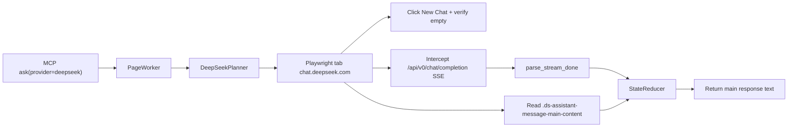

# DeepSeek Provider Design

**Date:** 2026-07-18  
**Status:** Approved (rev 2 — post ChatGPT/Gemini review)  
**Scope:** Add DeepSeek (chat.deepseek.com web) as a fourth provider in AI Router

## Summary

Add a `deepseek` provider that automates authenticated DeepSeek web sessions via Playwright/CloakBrowser, following the same adapter pattern as ChatGPT, Gemini, and Claude. Each `ask` opens a new chat, submits a prompt through the DOM, listens to the `/api/v0/chat/completion` SSE endpoint for stream-end signals, and reads the main response text from the DOM (excluding thinking blocks).

## Requirements (confirmed)

| Decision | Choice |
|----------|--------|
| Answer source | DOM only — `.ds-assistant-message-main-content` (stream is signal-only) |
| Thinking blocks | Excluded from returned text |
| Chat lifecycle | New chat per `ask` — navigate + explicit **New Chat** (root URL may restore last session) |
| Model selection | Use account default; no UI intervention |
| Thinking toggle | Use account UI default; no intervention |
| Stream completion | `event: close` after `response/status: FINISHED` (both required for SSE success) |
| Auth | Browser session (cookies + PoW headers auto-handled by web UI) |
| Challenge detection | Fail fast on Cloudflare Turnstile / verify UI during `wait_idle` |
| Answer timeout | Default `600s` (thinking models can run 3–5+ minutes) |

## Architecture



### Per-ask flow

1. `goto` → `https://chat.deepseek.com/`
2. `new_chat` → click **New Chat** button (or equivalent fresh-session action); verify chat area has no prior assistant messages
3. `wait_idle` → prompt input ready; fail fast if Cloudflare/challenge UI detected
4. Snapshot `assistant_count_before` via `read_response_snapshot`
5. `clear_input` → `type` → `submit`
6. `wait_generating` → generation started
7. `wait_answer` → stream end + DOM stable (shared StateReducer hybrid gate)
8. Wait until `assistant_count > assistant_count_before`, then read text from the new `.ds-assistant-message-main-content`

### Shared hybrid gate (StateReducer — not reimplemented per provider)

DeepSeek reuses the existing `StateReducer` completion logic:

| Mechanism | Default | Purpose |
|-----------|---------|---------|
| `answer_stable_ticks` | 4 | Consecutive DOM snapshots with unchanged response text |
| `dom_tick_interval_ms` | 500 | Polling interval (~2s stable window) |
| `stream_quiet_s` | 5.0 | Quiet period after SSE stream end before accepting answer |
| `no_stream_fallback_ticks` | 20 | DOM-only completion if SSE never signals (~10s stable) |

Generation complete when: stop button gone **and** (stream ended + quiet + stable ticks **or** no-stream DOM fallback).

## Module structure

```
src/ai_router/adapters/deepseek/
├── __init__.py
├── adapter.py      # DeepSeekAdapter
├── selectors.py    # URLs, regex, DOM selectors, error markers
├── stream.py       # parse_stream_done, SSE event+data iterator
├── wait.py         # is_stop_visible, read_response_snapshot, submit_ready, is_challenge_visible
└── planner.py      # DeepSeekPlanner
```

### DeepSeekAdapter

| Field | Value |
|-------|-------|
| `id` | `"deepseek"` |
| `name` | `"DeepSeek"` |
| `keywords` | `["deepseek", "@deepseek"]` |
| `status` | `"available"` |

`build_profile()` mirrors Claude wiring:

```python
ProviderProfile(
    provider_id="deepseek",
    stream_url_re=DEEPSEEK_COMPLETION_RE,
    parse_stream_done=parse_stream_done,
    is_stop_visible=is_stop_visible,
    read_response_snapshot=read_response_snapshot,
    is_rate_limited=is_rate_limited,
    submit_ready=submit_ready,
    planner=DeepSeekPlanner(),
    selectors=ProviderSelectors(
        prompt_input=SEL_PROMPT_INPUT,
        submit_button=SEL_SUBMIT_BUTTON,
    ),
    error_markers=DEEPSEEK_ERROR_MARKERS,
    recoverable_codes=("DEEPSEEK_ERROR",),
    answer_timeout_s=cfg.deepseek_answer_timeout_s,
    parse_ws_frame=None,
)
```

## Stream parsing

### Network interception

```python
DEEPSEEK_COMPLETION_RE = re.compile(
    r"/api/v\d+/chat/completion(?:\?|$)",
    re.I,
)
```

Loose version match (`v0`, `v1`, …) to survive API version bumps. The shared `StateReducer` already ignores stale streams whose `last_stream_at < submitted_at` and resets `stream_ended_at` when a new matching request starts — this covers SSE reconnection / retry POSTs for the same ask.

### SSE format

DeepSeek web uses named SSE events with JSON Patch-style payloads:

```
event: ready
data: {"request_message_id":3,"response_message_id":4,"model_type":"expert"}

data: {"p":"response/fragments/-1/content","o":"APPEND","v":" need"}
data: {"p":"response/status","o":"SET","v":"FINISHED"}

event: close
data: {"click_behavior":"none","auto_resume":false}
```

Unlike Claude/ChatGPT parsers (which scan `data:` lines only), DeepSeek requires parsing **`event:` lines** together with their adjacent `data:` payloads. Intermediate THINK fragment patches are ignored for completion detection.

### `parse_stream_done(status, body) → StreamDone`

Treat as a small state machine over patch payloads and named events — not a single boolean.

| Condition | Result |
|-----------|--------|
| HTTP 401, 403, 429 or body contains rate-limit markers | `done=True, ok=False, error_kind="rate_limit"` |
| HTTP ≥ 400 (other) | `done=True, ok=False, error_kind="error"` |
| Patch `response/status` SET to `ERROR`, `FAILED`, `CANCELLED`, `INTERRUPTED`, or similar | `done=True, ok=False, error_kind="error"` |
| `event: close` **without** prior `FINISHED` / success quasi_status | `done=False` (abnormal close — rely on DOM fallback or timeout) |
| `event: close` **after** `response/status: FINISHED` or BATCH `quasi_status: FINISHED` | `done=True, ok=True` |
| Patch `{"p":"response/status","o":"SET","v":"FINISHED"}` alone (no `close` yet) | `done=False` (wait for `close` or let reducer DOM-fallback) |
| BATCH patch with `quasi_status: "FINISHED"` | Record success signal; still require `event: close` for `done=True, ok=True` |
| Partial stream (THINK fragments only, no end signal) | `done=False, ok=False` |

**Success rule:** SSE success requires **both** a FINISHED status signal **and** `event: close`. This avoids treating abnormal connection drops as successful completions.

Answer text is read from the DOM by StateReducer — not from SSE `RESPONSE` fragment patches.

## DOM selectors

### Response (from captured HTML)

Use a fallback chain (prefer stable attributes over CSS hashes):

```python
# Tier 1: semantic / test ids (discover during implementation)
SEL_ASSISTANT_MAIN = (
    '[data-testid="assistant-message"], '
    ".ds-assistant-message-main-content"
)
SEL_ASSISTANT_TEXT = (
    '[data-testid="assistant-message"] .ds-markdown, '
    ".ds-assistant-message-main-content .ds-markdown"
)
# Excluded: .ds-think-content (thinking blocks)
```

### `read_response_snapshot(page)`

1. Count assistant turns via `SEL_ASSISTANT_MAIN`
2. Read `.ds-markdown` inner_text from the **last** main-content block
3. Return `(count, text)`

Callers compare `count` before and after submit to ensure the read targets the new response, not a stale message from a prior session.

### `is_stop_visible(page)`

Returns `True` while either:

- A Stop button is visible (e.g. `aria-label*="Stop"`), or
- Generation indicators are present before main content appears

Stop button alone is not sufficient for completion — always combined with StateReducer hybrid gate.

### Input / submit (discover during implementation)

Target DeepSeek-specific containers; avoid generic page-wide `textarea` matches:

```python
DEEPSEEK_URL = "https://chat.deepseek.com/"

SEL_NEW_CHAT = (
    'button[aria-label*="New chat" i], '
    'a[aria-label*="New chat" i], '
    'button:has-text("New chat")'
)
SEL_PROMPT_INPUT = (
    '.ds-chat-input-container textarea, '
    '#chat-input, '
    'textarea:not([aria-hidden="true"]):visible, '
    'div[contenteditable="true"]:visible'
)
SEL_SUBMIT_BUTTON = (
    'button[aria-label*="Send" i], '
    'button[type="submit"]'
)
SEL_LOGIN = 'a[href*="/login"], button:has-text("Log in")'
SEL_CHALLENGE = (
    'iframe[src*="challenges.cloudflare.com"], '
    'iframe[src*="turnstile"], '
    '[class*="turnstile"], '
    'text=/verify|checking your browser/i'
)
```

`submit_ready`: input must be visible, attached, and editable before typing.

### Error markers

```python
DEEPSEEK_ERROR_MARKERS = (
    "something went wrong",
    "unable to respond",
    "an error occurred",
)

RATE_LIMIT_MARKERS = (
    "rate limit",
    "too many requests",
    "try again later",
)

CHALLENGE_MARKERS = (
    "checking your browser",
    "verify you are human",
)
```

## Planner

```python
[
    Command("goto", {"url": DEEPSEEK_URL}),
    Command("new_chat"),          # click New Chat; verify empty session
    Command("wait_idle"),         # includes challenge detection
    Command("clear_input"),
    Command("type", {"prompt": job.prompt}),
    Command("submit"),
    Command("wait_generating"),
    Command("wait_answer"),
]
```

`new_chat` is a new command (or inline planner step) that clicks `SEL_NEW_CHAT` and waits until no assistant messages remain. If no New Chat control is found, fall back to navigating to a fresh-session URL discovered during implementation.

Recovery uses the same script (reload + retry) as ChatGPT and Claude.

## Config & registry

### Registry

Register `DeepSeekAdapter()` in `build_registry()` alongside Gemini, ChatGPT, and Claude.

### Config defaults

```yaml
providers:
  deepseek:
    url: "https://chat.deepseek.com/"
```

`deepseek_answer_timeout_s` in `AppConfig`. Default **`600.0`** (thinking models can exceed 300s); YAML/env overrides supported. While THINK fragments are actively arriving on the SSE stream, the page worker's existing answer timeout applies to the whole job — no separate rolling timer in v1, but the higher ceiling accommodates long thinking runs.

Environment variable: `AI_ROUTER_DEEPSEEK_ANSWER_TIMEOUT_S`.

## Session / login

- `check_session`: navigate to `https://chat.deepseek.com/`, wait for `SEL_PROMPT_INPUT` → `LOGGED_IN`
- `SEL_LOGIN` visible → `LOGGED_OUT`
- `SEL_CHALLENGE` visible → `UNKNOWN` (or dedicated challenge status if added)
- Timeout without any → `UNKNOWN`
- CLI: `ai-router browser login --provider deepseek` (reuses existing browser login flow)

During `wait_idle`, if `is_challenge_visible(page)` returns true, fail immediately with a clear error (`DEEPSEEK_CHALLENGE` or `DEEPSEEK_ERROR`) rather than waiting for input timeout.

## Error handling

| Code | Trigger |
|------|---------|
| `DEEPSEEK_ERROR` | DOM error markers, non-recoverable HTTP errors, or challenge UI |
| `DEEPSEEK_CHALLENGE` | Cloudflare Turnstile / verify page detected (optional sub-code) |
| Rate limit | HTTP 429, auth errors, or rate-limit markers in body/DOM |

Recoverable codes for planner retry: `("DEEPSEEK_ERROR",)`. Challenge errors are **not** recoverable via reload retry in v1 — user must complete verification manually via `browser login`.

Partial SSE without `event: close` + FINISHED returns `done=False`. The job relies on StateReducer DOM no-stream fallback or times out — same as Claude.

If SSE dies mid-stream but DOM keeps growing, trust the DOM via `no_stream_fallback_ticks` (existing behavior).

## Testing

Unit tests only (no live browser required):

### `tests/test_deepseek_stream.py`

- `event: close` after FINISHED → `done=True, ok=True`
- `response/status SET FINISHED` without `close` → `done=False`
- BATCH `quasi_status: FINISHED` + `event: close` → `done=True, ok=True`
- `response/status SET ERROR` → `done=True, ok=False, error_kind="error"`
- `event: close` without FINISHED → `done=False`
- Partial stream (THINK fragments only) → `done=False`
- HTTP 429 → `error_kind="rate_limit"`

### `tests/test_deepseek_planner.py`

- Plan includes `goto` to `chat.deepseek.com`
- Plan includes `new_chat` before submit
- Core command sequence: new_chat → clear → type → submit → wait

### Other updates

- `tests/test_router.py` — add case resolving `provider=deepseek`
- `tests/test_ask_multi.py` — include deepseek in available providers list

## Documentation

Update README:

- Add DeepSeek to supported providers table
- Add `ai-router browser login --provider deepseek` example
- Note 600s default timeout for thinking models
- `list_providers` returns `deepseek` with `status: available`

## Out of scope

- Direct API calls with Bearer token (web automation only)
- Model selection via UI or config
- Multi-turn conversation (keeping existing chat)
- Extracting answer text from SSE `RESPONSE` fragment patches
- Thinking content in returned text
- PoW solver implementation (`x-ds-pow-response` — browser handles it)
- WebSocket completion source (`parse_ws_frame`)
- Rolling timeout that resets per THINK fragment (v1 uses fixed 600s ceiling)
- Stealth/fingerprint hardening beyond existing CloakBrowser setup

## Review revisions (2026-07-18)

Incorporated feedback from ChatGPT and Gemini parallel review:

| Priority | Change |
|----------|--------|
| P0 | Explicit **New Chat** step — root URL may restore last session |
| P0 | Stream success requires FINISHED + `event: close`; error states fail fast |
| P1 | Challenge/Turnstile detection in `wait_idle` with fail-fast error |
| P1 | Default timeout raised to 600s for long thinking runs |
| P1 | Hardened input selectors scoped to chat container |
| P2 | Document shared StateReducer hybrid gate (not per-provider) |
| P2 | Looser completion URL regex; stale-stream handling via existing reducer |

## Reference: captured completion request

```
POST https://chat.deepseek.com/api/v0/chat/completion
Accept: text/event-stream
Content-Type: application/json
Authorization: Bearer <session token>
x-ds-pow-response: <PoW challenge response>
x-hif-leim: <anti-bot header>

Body: {
  "chat_session_id": "<uuid>",
  "parent_message_id": 2,
  "model_type": null,
  "prompt": "2+2",
  "thinking_enabled": true,
  "search_enabled": false,
  ...
}
```

Stream end signals: `response/status SET FINISHED`, then `event: close`.
