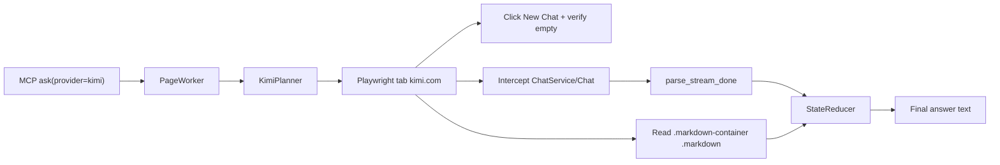

# Kimi Provider Design

**Date:** 2026-07-19  
**Status:** Approved  
**Scope:** Add Kimi (www.kimi.com web) as a fifth provider in AI Router

## Summary

Add a `kimi` provider that automates authenticated Kimi web sessions via Playwright/CloakBrowser, following the same adapter pattern as ChatGPT, Gemini, Claude, and DeepSeek. Each `ask` opens a new chat, submits a prompt through the DOM, listens to the `ChatService/Chat` Connect RPC endpoint for stream-end signals (`MESSAGE_STATUS_COMPLETED`), and reads the final answer text from the DOM (excluding thinking blocks and UI chrome).

## Requirements (confirmed)

| Decision | Choice |
|----------|--------|
| Integration | Browser automation (CloakBrowser) — not direct HTTP API |
| Answer source | DOM only — `.markdown-container .markdown` (stream is signal-only) |
| Thinking blocks | Excluded from returned text |
| Chat lifecycle | New chat per `ask` — navigate + explicit **New Chat** |
| Model/scenario | Use account default; no UI intervention |
| Stream completion | `MESSAGE_STATUS_COMPLETED` in Connect RPC response body |
| Auth | Browser session (cookies + `x-msh-*` headers auto-handled by web UI) |
| Answer timeout | Default `600s` (thinking mode can run 3–5+ minutes) |

## Architecture



### Per-ask flow

1. `goto` → `https://www.kimi.com/`
2. `new_chat` → click **New Chat** (or equivalent); verify no prior assistant segments
3. `wait_idle` → prompt input ready; fail fast if challenge/login UI detected
4. Snapshot `assistant_count_before` via `read_response_snapshot`
5. `clear_input` → `type` → `submit`
6. `wait_generating` → generation started
7. `wait_answer` → Connect stream end + DOM stable (shared StateReducer hybrid gate)
8. Wait until `assistant_count > assistant_count_before`, then read text from the new `.markdown-container .markdown`

### Shared hybrid gate (StateReducer — not reimplemented per provider)

Kimi reuses the existing `StateReducer` completion logic:

| Mechanism | Default | Purpose |
|-----------|---------|---------|
| `answer_stable_ticks` | 4 | Consecutive DOM snapshots with unchanged response text |
| `dom_tick_interval_ms` | 500 | Polling interval (~2s stable window) |
| `stream_quiet_s` | 5.0 | Quiet period after stream end before accepting answer |
| `no_stream_fallback_ticks` | 20 | DOM-only completion if Connect stream never signals (~10s stable) |

Generation complete when: stop button gone **and** (stream ended + quiet + stable ticks **or** no-stream DOM fallback).

## Module structure

```
src/ai_router/adapters/kimi/
├── __init__.py
├── adapter.py      # KimiAdapter
├── selectors.py    # URLs, regex, DOM selectors, error markers
├── stream.py       # Connect frame parser + parse_stream_done
├── wait.py         # DOM wait helpers, ensure_new_chat, challenge check
└── planner.py      # KimiPlanner
```

### KimiAdapter

| Field | Value |
|-------|-------|
| `id` | `"kimi"` |
| `name` | `"Kimi"` |
| `keywords` | `["kimi", "@kimi", "moonshot"]` |
| `status` | `"available"` |

`build_profile()` mirrors DeepSeek wiring:

```python
ProviderProfile(
    provider_id="kimi",
    stream_url_re=KIMI_CHAT_RE,
    parse_stream_done=parse_stream_done,
    is_stop_visible=is_stop_visible,
    read_response_snapshot=read_response_snapshot,
    is_rate_limited=is_rate_limited,
    submit_ready=submit_ready,
    planner=KimiPlanner(),
    selectors=ProviderSelectors(
        prompt_input=SEL_PROMPT_INPUT,
        submit_button=SEL_SUBMIT_BUTTON,
    ),
    error_markers=KIMI_ERROR_MARKERS,
    recoverable_codes=("KIMI_ERROR",),
    answer_timeout_s=cfg.kimi_answer_timeout_s,
    parse_ws_frame=None,
    on_new_chat=ensure_new_chat,
    is_challenge_visible=is_challenge_visible,
)
```

## Stream parsing (Connect RPC)

### Network interception

```python
KIMI_CHAT_RE = re.compile(
    r"/apiv2/kimi\.gateway\.chat\.v1\.ChatService/Chat(?:\?|$)",
    re.I,
)
```

Loose match on the RPC method path; the shared `StateReducer` ignores stale streams whose `last_stream_at < submitted_at` and resets `stream_ended_at` when a new matching request starts.

### Protocol

Kimi uses **Connect RPC** (`application/connect+json`), not SSE:

- Endpoint: `POST https://www.kimi.com/apiv2/kimi.gateway.chat.v1.ChatService/Chat`
- Auth: Bearer JWT + `kimi-auth` cookie (browser-managed)
- Extra headers: `x-msh-device-id`, `x-msh-session-id`, `x-msh-platform`, `x-msh-version`, `x-msh-shield-data`, `x-traffic-id` (browser-managed)
- Request body: JSON with `chat_id`, `scenario`, `tools`, `message`, `options` (e.g. `thinking: true`)

Streaming frames use Connect envelope format:

```
[1-byte flags][4-byte BE uint32 length][JSON payload]
```

- `flags & 0x80` = EndStream (auxiliary signal)
- Payload = JSON object(s) containing status fields

### Body reading change

Connect RPC responses may contain binary frame headers. `response.text()` can fail with invalid UTF-8.

Add a boolean flag on `ProviderProfile`:

```python
read_response_bytes: bool = False  # Kimi sets True; all other providers keep False
```

Update `events.handle_response`:

```python
if profile.read_response_bytes:
    raw = await response.body()
    result = profile.parse_stream_done(status, raw)
else:
    text = await response.text()
    result = profile.parse_stream_done(status, text)
```

Extend Kimi's `parse_stream_done` to accept `str | bytes`. Other providers keep `str`-only signatures (bytes are never passed).

### `parse_stream_done(status, body) → StreamDone`

Use **Approach 1: full Connect frame parser** with substring fallback.

| Condition | Result |
|-----------|--------|
| HTTP 401, 403, 429 or body contains rate-limit markers | `done=True, ok=False, error_kind="rate_limit"` |
| HTTP ≥ 400 (other) | `done=True, ok=False, error_kind="error"` |
| Status field in `FAILURE_STATUSES` (e.g. `MESSAGE_STATUS_FAILED`, `MESSAGE_STATUS_CANCELLED`) | `done=True, ok=False, error_kind="error"` |
| `MESSAGE_STATUS_COMPLETED` in any parsed frame | `done=True, ok=True` |
| Partial stream (no terminal status) | `done=False, ok=False` |

**Status field paths to scan** (deep-search each parsed JSON object):

- `status`
- `message.status`
- `result.status`

**Success rule:** any frame contains `MESSAGE_STATUS_COMPLETED`. Do not assume the last frame is the completion marker — scan the entire body.

**Fallback:** if frame parser yields zero messages, decode with `errors="replace"` and substring-scan for `"MESSAGE_STATUS_COMPLETED"`.

Answer text is read from the DOM by StateReducer — not from Connect stream payloads.

### Connect frame parser

```python
def iter_connect_json_frames(raw: bytes) -> Iterator[dict]:
    offset = 0
    while offset + 5 <= len(raw):
        flags = raw[offset]
        length = int.from_bytes(raw[offset + 1 : offset + 5], "big")
        offset += 5
        if offset + length > len(raw):
            break
        payload = raw[offset : offset + length]
        offset += length
        try:
            obj = json.loads(payload.decode("utf-8"))
            if isinstance(obj, dict):
                yield obj
        except (UnicodeDecodeError, json.JSONDecodeError):
            continue
```

## DOM selectors

### Confirmed from captured HTML (assistant response)

Kimi assistant turns render as:

```
.segment-content
└── .segment-content-box
    ├── .markdown-container          ← main answer content
    │   └── .markdown
    │       ├── .paragraph, h2, ul, li
    │       ├── .table.markdown-table  (contains UI chrome)
    │       └── .katex-wrapper         (math — inner_text OK)
    ├── .okc-cards-container           (usually empty)
    └── .segment-assistant-actions     (Copy/Like/Share — exclude)
```

### Selectors

```python
KIMI_URL = "https://www.kimi.com/"

SEL_NEW_CHAT = (
    'button[aria-label*="New chat" i], '
    'a[aria-label*="New chat" i], '
    'button:has-text("New chat")'
)
SEL_PROMPT_INPUT = (
    'textarea:not([aria-hidden="true"]):visible, '
    'div[contenteditable="true"]:visible'
)
SEL_SUBMIT_BUTTON = (
    'button[aria-label*="Send" i], '
    'button[type="submit"]'
)
SEL_LOGIN = 'a[href*="/login"], button:has-text("Log in")'
SEL_CHALLENGE = (
    'iframe[src*="challenges.cloudflare.com"], '
    'iframe[src*="turnstile"], '
    '[class*="turnstile"], '
    'text=/verify|checking your browser/i'
)

# Assistant response (confirmed)
SEL_ASSISTANT_MAIN = ".segment-content-box"
SEL_ASSISTANT_TEXT = ".markdown-container .markdown"

# UI chrome to strip before reading text
SEL_UI_CHROME = (
    ".segment-assistant-actions, "
    ".table-actions, "
    ".icon-button, "
    ".kimi-tooltip, "
    ".okc-cards-container"
)

# Thinking blocks (verify during implementation when thinking HTML available)
SEL_THINKING = (
    ".thinking-content, "
    "[class*='thinking'], "
    "details.thinking"
)

SEL_STOP_BUTTON = 'button[aria-label*="Stop" i]'
```

### `read_response_snapshot(page) → (count, text)`

1. Count assistant turns via `SEL_ASSISTANT_MAIN` (`.segment-content-box`)
2. Take the **last** segment
3. Locate `SEL_ASSISTANT_TEXT` (`.markdown-container .markdown`)
4. Strip `SEL_UI_CHROME` subtrees before reading text (table headers inject `"Table"`, `"Copy"`, `"Download"` noise)
5. Return `(count, text)`

```python
text = await markdown.evaluate("""(el) => {
    const clone = el.cloneNode(true);
    clone.querySelectorAll(
        '.table-actions, .icon-button, .kimi-tooltip'
    ).forEach(n => n.remove());
    return clone.innerText.trim();
}""")
```

Callers compare `count` before and after submit to ensure the read targets the new response.

### `is_stop_visible(page)`

Returns `True` while:

- Stop button visible (`SEL_STOP_BUTTON`), or
- Generating indicators present in the assistant segment before markdown content appears

### Input / submit

Target Kimi-specific containers; avoid generic page-wide `textarea` matches. Discover `SEL_PROMPT_INPUT` and `SEL_SUBMIT_BUTTON` precisely during implementation on live kimi.com.

`submit_ready`: input must be visible, attached, and editable before typing.

### Error markers

```python
KIMI_ERROR_MARKERS = (
    "something went wrong",
    "unable to respond",
    "an error occurred",
)

RATE_LIMIT_MARKERS = (
    "rate limit",
    "too many requests",
    "try again later",
)

FAILURE_STATUSES = frozenset({
    "MESSAGE_STATUS_FAILED",
    "MESSAGE_STATUS_CANCELLED",
    "MESSAGE_STATUS_ERROR",
})
```

## Planner

```python
[
    Command("goto", {"url": KIMI_URL}),
    Command("new_chat"),
    Command("wait_idle"),
    Command("clear_input"),
    Command("type", {"prompt": job.prompt}),
    Command("submit"),
    Command("wait_generating"),
    Command("wait_answer"),
]
```

Recovery uses the same script (reload + retry) as ChatGPT, Claude, and DeepSeek.

## Config & registry

### Registry

Register `KimiAdapter()` in `build_registry()` alongside Gemini, ChatGPT, Claude, and DeepSeek.

### Config defaults

```yaml
providers:
  kimi:
    url: "https://www.kimi.com/"
```

`kimi_answer_timeout_s` in `AppConfig`. Default **`600.0`**; YAML/env overrides supported.

Environment variable: `AI_ROUTER_KIMI_ANSWER_TIMEOUT_S`.

## Session / login

- `check_session`: navigate to `https://www.kimi.com/`, wait for `SEL_PROMPT_INPUT` → `LOGGED_IN`
- `SEL_LOGIN` visible → `LOGGED_OUT`
- `SEL_CHALLENGE` visible → `UNKNOWN`
- Timeout without any → `UNKNOWN`
- CLI: `ai-router browser login --provider kimi`

During `wait_idle`, if `is_challenge_visible(page)` returns true, fail immediately with `KIMI_ERROR` rather than waiting for input timeout.

## Error handling

| Code | Trigger |
|------|---------|
| `KIMI_ERROR` | DOM error markers, non-recoverable HTTP errors, stream failure status, challenge UI |
| Rate limit | HTTP 429, auth errors, or rate-limit markers in body/DOM |

Recoverable codes for planner retry: `("KIMI_ERROR",)`. Challenge errors are **not** recoverable via reload retry in v1 — user must complete verification manually via `browser login`.

Partial Connect stream without `MESSAGE_STATUS_COMPLETED` returns `done=False`. The job relies on StateReducer DOM no-stream fallback or times out.

## Testing

Unit tests only (no live browser required):

### `tests/test_kimi_stream.py`

- Connect frame with `MESSAGE_STATUS_COMPLETED` → `done=True, ok=True`
- `MESSAGE_STATUS_FAILED` → `done=True, ok=False, error_kind="error"`
- Partial stream (no terminal status) → `done=False`
- HTTP 429 → `error_kind="rate_limit"`
- Substring fallback when frame parser yields zero messages
- Nested status paths (`message.status`, `result.status`)

### `tests/test_kimi_planner.py`

- Plan includes `goto` to `kimi.com`
- Plan includes `new_chat` before submit
- Core command sequence: new_chat → clear → type → submit → wait

### Other updates

- `tests/test_router.py` — add case resolving `provider=kimi`
- `tests/test_ask_multi.py` — include kimi in available providers list
- `tests/test_config.py` — default kimi provider URL + 600s timeout

## Documentation

Update README:

- Add Kimi to supported providers table
- Add `ai-router browser login --provider kimi` example
- Note 600s default timeout for thinking models
- `list_providers` returns `kimi` with `status: available`

Update `pyproject.toml` description/keywords to include `kimi`.

## Out of scope

- Direct API calls with Bearer token (web automation only)
- Model/scenario selection via UI or config
- Multi-turn conversation (keeping existing chat)
- Extracting answer text from Connect stream payloads
- Thinking content in returned text
- Incremental chunk reading before `response.finished()` (Approach 3)
- `x-msh-shield-data` fingerprint implementation (browser handles it)
- WebSocket completion source (`parse_ws_frame`)

## Review revisions (2026-07-19)

Incorporated feedback from Gemini, ChatGPT, and DeepSeek parallel review, plus captured HTML:

| Priority | Change |
|----------|--------|
| P0 | Connect RPC frame parser + bytes body reading (not SSE / not `response.text()`) |
| P0 | Confirmed DOM selectors: `.segment-content-box` + `.markdown-container .markdown` |
| P0 | Strip `.table-actions` UI chrome before text extraction |
| P1 | Default timeout 600s for thinking mode |
| P1 | Explicit **New Chat** step per ask |
| P2 | Substring fallback if frame parser yields zero messages |
| P2 | Document shared StateReducer hybrid gate |

## Reference: captured chat request

```
POST https://www.kimi.com/apiv2/kimi.gateway.chat.v1.ChatService/Chat
Content-Type: application/connect+json
connect-protocol-version: 1
Authorization: Bearer <session token>

Body: {
  "chat_id": "<uuid>",
  "scenario": "SCENARIO_K2D5",
  "tools": [...],
  "message": {
    "parent_id": "<uuid>",
    "role": "user",
    "blocks": [{"text": {"content": "..."}}],
    ...
  },
  "options": {
    "thinking": true,
    "enable_plugin": true,
    "reasoning_effort": "REASONING_EFFORT_NONE"
  }
}
```

Stream end signal: `MESSAGE_STATUS_COMPLETED` in Connect RPC response frames.
